# Architecture — Sequence Diagrams

Sequence diagrams for every use case, showing the full DDD layer stack:
**Presentation → Application → Domain → Infrastructure → SQLite**

Source files are `.puml`. SVGs are auto-generated by the
[Render PlantUML diagrams](../../.github/workflows/render-diagrams.yml) workflow
on every push — edit the `.puml`, the SVG updates automatically.

---

## Authentication (`identity` bounded context)

### 1. Register User — `POST /auth/register`

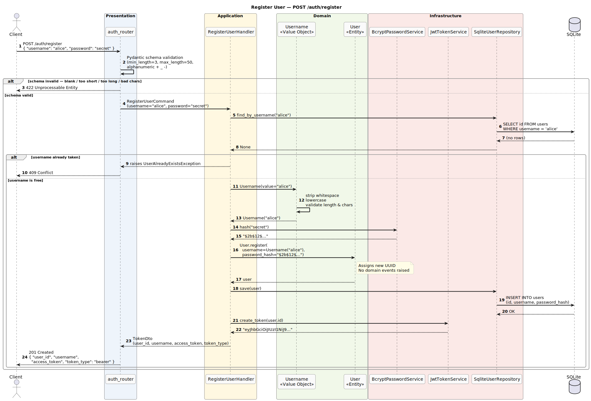

---

### 2. Login — `POST /auth/token`

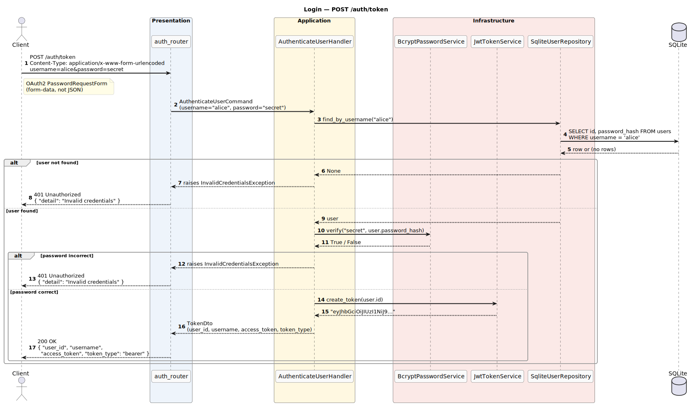

---

### 3. Get Current User — `GET /auth/me`

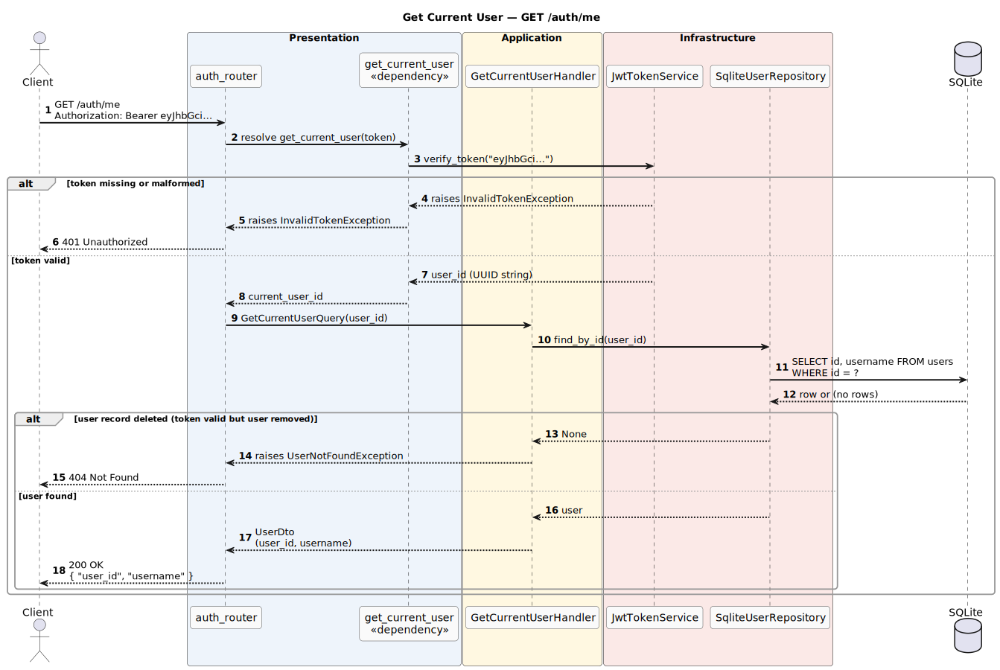

---

## Pets (`petstore` bounded context)

### 4. Register Pet — `POST /pets`

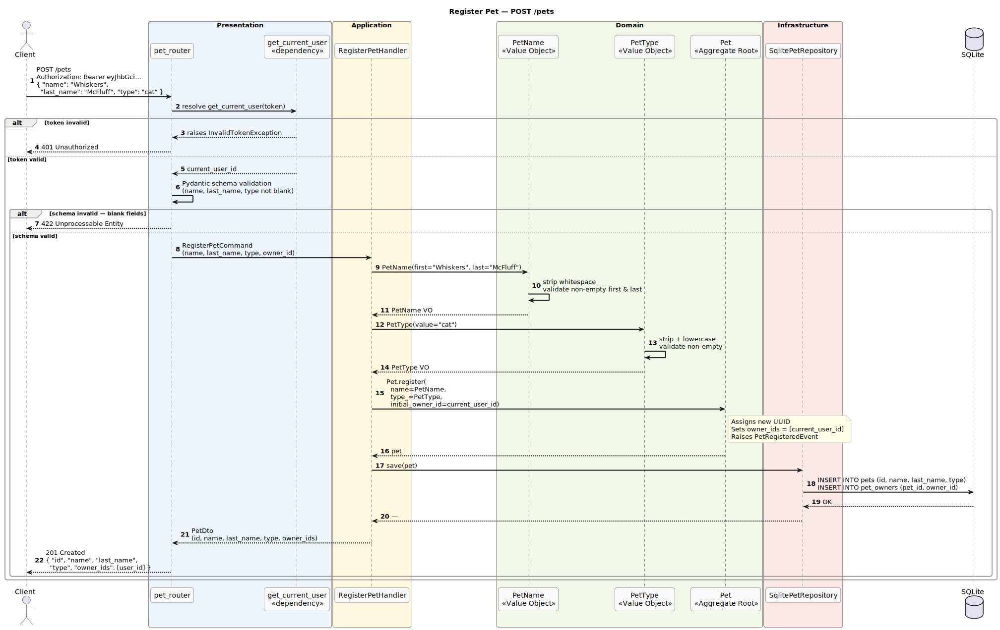

---

### 5. List Pets — `GET /pets`

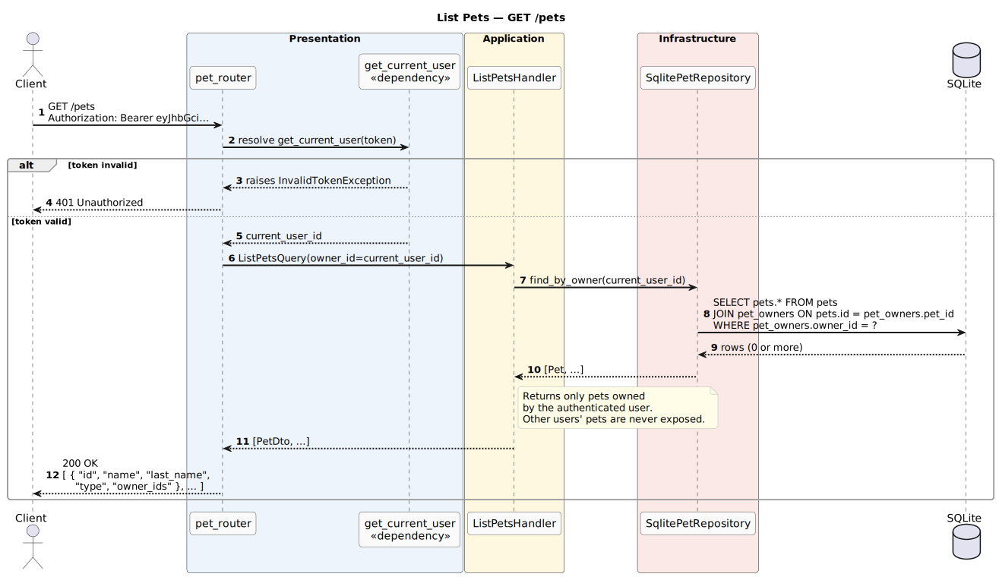

---

### 6. Get Pet — `GET /pets/{id}`

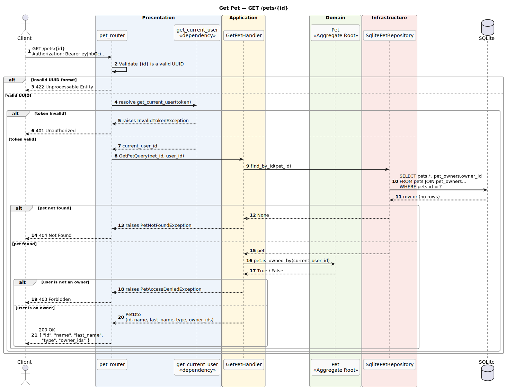

---

### 7. Update Pet — `PATCH /pets/{id}`

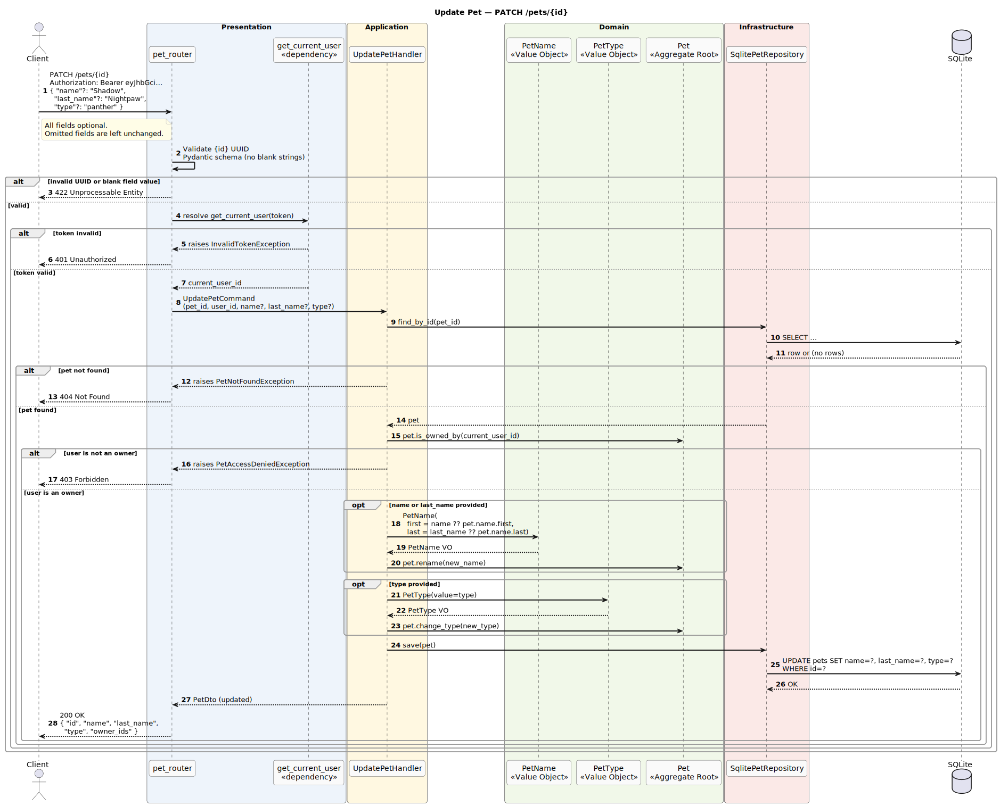

---

### 8. Delete Pet — `DELETE /pets/{id}`

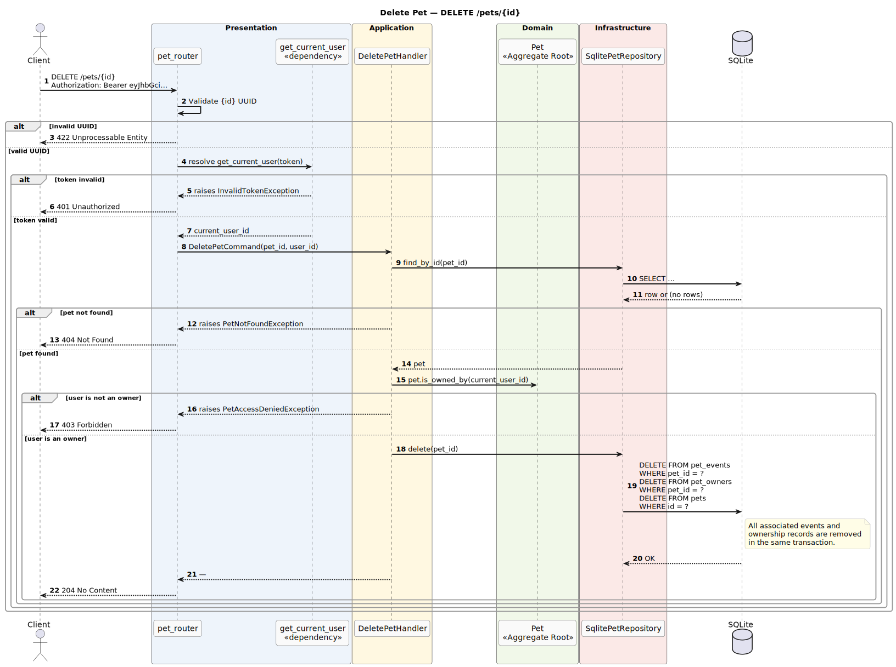

---

### 9. Add Owner — `POST /pets/{id}/owners`

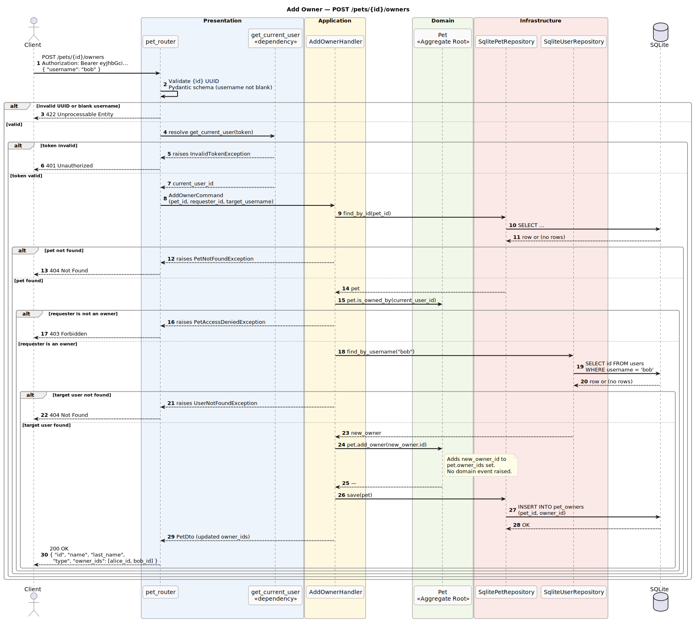

---

### 10. Remove Owner — `DELETE /pets/{id}/owners/{owner_id}`

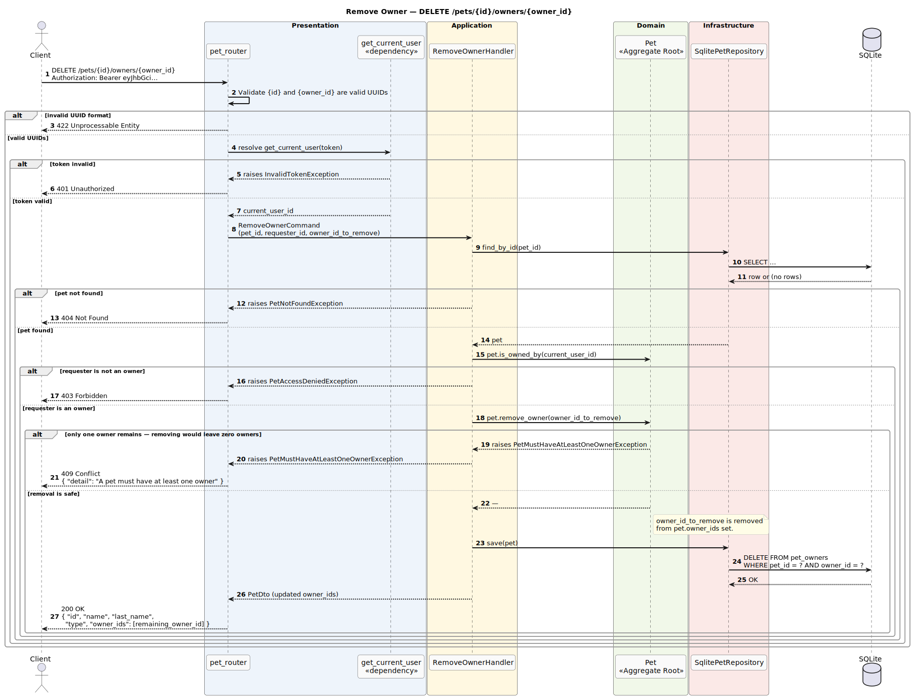

---

## Pet Events (`petstore` bounded context)

### 11. Add Event — `POST /pets/{pet_id}/events`

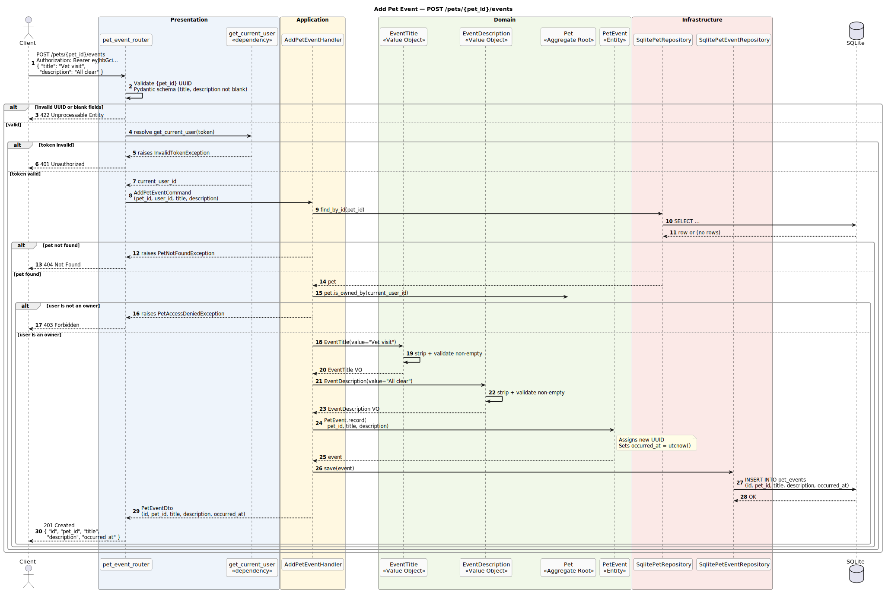

---

### 12. List Events — `GET /pets/{pet_id}/events`

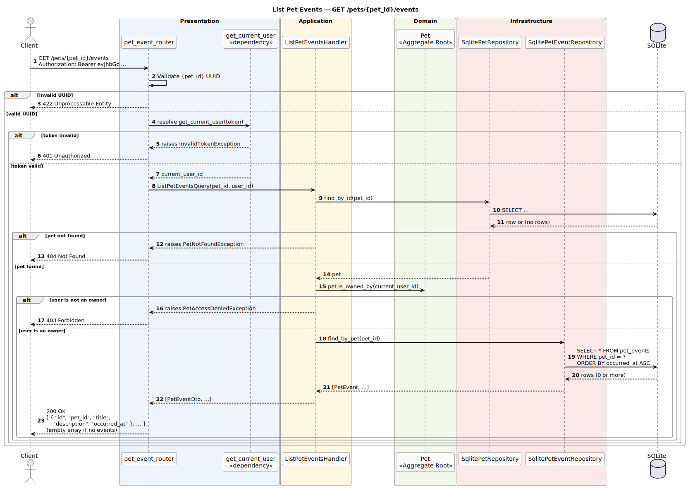

---

### 13. Get Event — `GET /pets/{pet_id}/events/{event_id}`

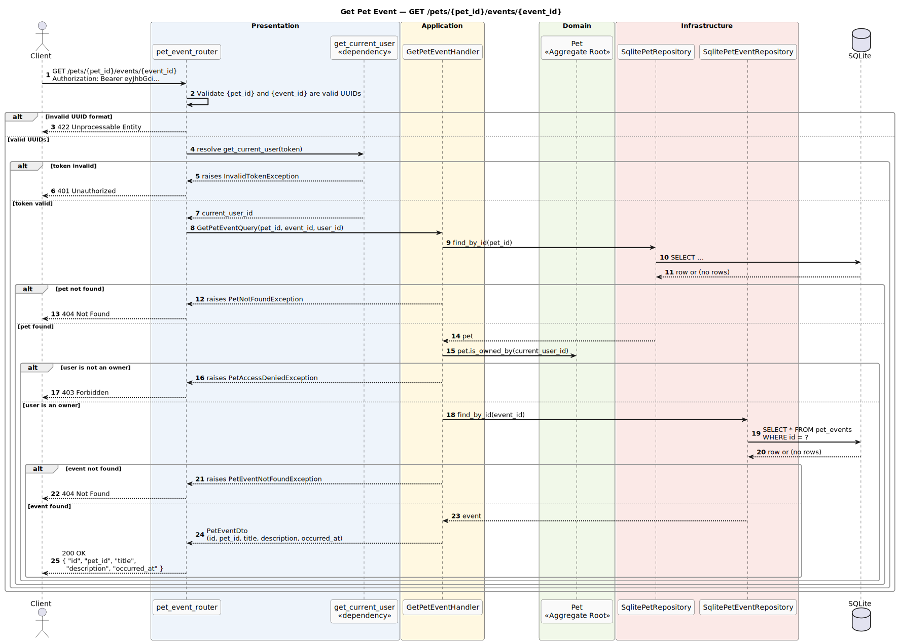

---

### 14. Delete Event — `DELETE /pets/{pet_id}/events/{event_id}`

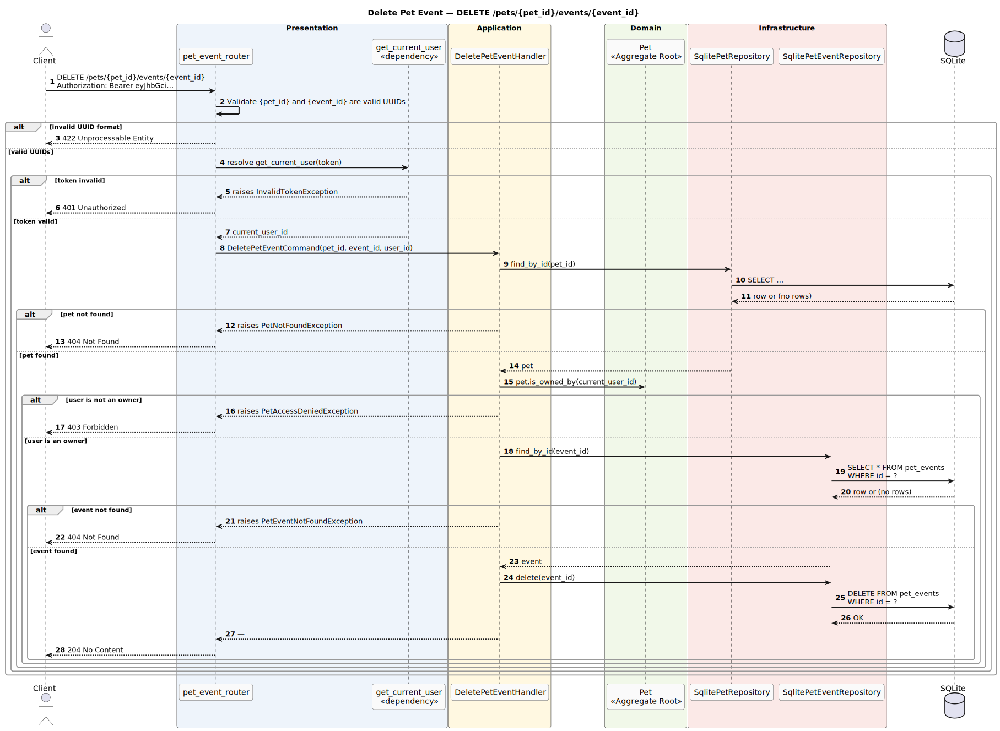
